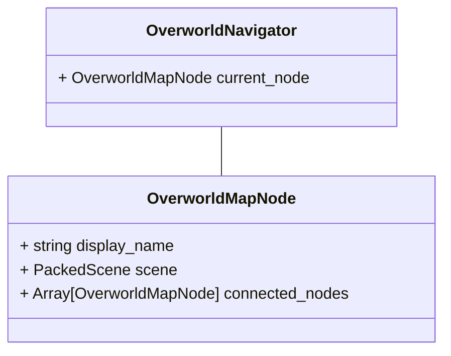
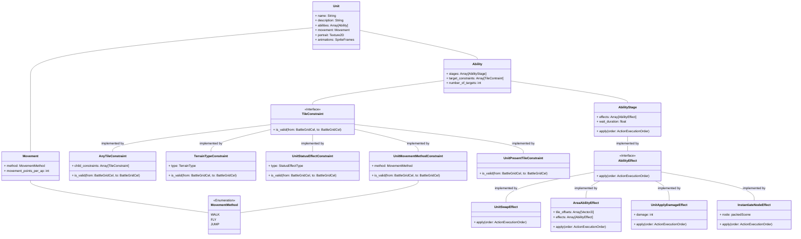
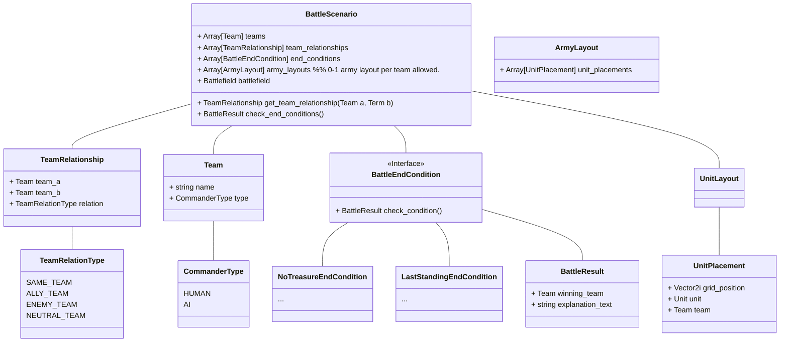

# Scenes
  
# DialogBox Scene
- Instantiated within the scene whenever there is dialog for the player to read
- Given a reference to a DialogContents resource which describes the text to be displayed and how to display it
    
# Overworld Scene
- Node representing the player, that will move around to select the next level the player wishes to load
- A series of [[OverworldMapNode]]s are placed in the scene representing the levels the player can play
    - Will contain a reference to the scene to be loaded
    - Will contain references to the other level nodes that this one is connected to in the overworld
- The available navigation paths are determined by the [[OverworldMapNode]]s via their connections

  
# BattleScenario scene
TODO
# Tools
  
### Ability Editor
- Needed functionality - rough rough draft
    - Ability to create abilities separate from their units
    - Abilities can be assigned to units separate from this editor
    - Should be able to define
        - Who/what is targetable
    - The logical effects that happen when the ability is cast
    - The visual effects that happen when the ability is cast
    - Defining target constraints:
        - TileConstraint is a script that will be inherited by various types of constraints, which define what cells are targetable
        - Multiple tile constraints can be defined per ability. All must be satisfied in order to be able to cast on the tile (AND behavior)
        - AnyTileConstraint is available if it is preferred to allow any of the listed tile constraints be satisfied in order to cast (OR behavior)
        - TileConstraint list:
            - UnitPresentConstraint - Requires that a unit be present on the tile
            - RangeConstraint - Requires that the target tile be within the min and max range defined
                - min_range: int
                - max_range: int
                - **TODO: we will want to consider how we are calculating distance. This choice should probably be consistent across all distance calculations in the game.**
                    - **Manhattan distance: [https://en.wikipedia.org/wiki/Taxicab_geometry](https://en.wikipedia.org/wiki/Taxicab_geometry) - sum of difference of x and y**
                    - **Euclidean distance: [https://en.wikipedia.org/wiki/Euclidean_distance](https://en.wikipedia.org/wiki/Euclidean_distance) - sqrt(dx*dx + dy*dy))**
            - TerrainConstraint - The tile must be of the specified type of terrain
                - type: TerrainType
            - AnyTileConstraint - If any of the tile constraint members of this are satisfied, the constraint is valid
                - constraints: Array[TileConstraint]
            - UnitStatusEffectConstraint - The unit in the target cell must have the specified status effect
                - status_effect: StatusEffect
            - UnitMovementMethodConstraint - The unit in the target cell must have the specified movement type. For example, can only target enemies who can fly
                - movement_method: MovementMethod
    - Defining the effect the ability has on the battlefield
        - AbilityEffect is a script that will be inherited by various types of Effects
            - logical effects (such as HP reduction, changes in position),
            - visual effects (sprite animations that appear on specific tiles)
        - AbilityEffects are given both the target tile and the unit using the ability when executing
        - AreaAbilityEffect is provided for spells that affect multiple cells - The given AbilityEffect will be applied to all of the cells defined in the area
            - Array[Vector2i] tile_offsets
            - effect: AbilityEffect
        - Mutliple AbilityEffects are defined on an Ability to fully describe what happens on the battlefield
        - The AbilityEffects are played in sequence, and a configurable amount of time is waited for between each effect
        - Each AbilityEffect can have a defined TileConstraint, to fully capture conditional effects (i.e an AoE that can’t hurt allies)
        - Types of effects
            - UnitEffectPlayAnimation - Cause the unit on the affected tile to
                - animation_name: String - the animation for the unit to play
                - potentially have control over the speed, start frame, loop, etc
            - InstantiateNode - instantiates a node on the applied tile. For example can be used for summoning, or creating a fire animation sprite on the tile
                - node_to_create: PackedScene
            - UnitEffectApplyDamage - Applies damage to the unit
                - damage: Damage

  
Random questions to answer
- How do status effects work?
    - Does the unit own them?
- Need to walk through how ability previews work
  
### BattleScenario Editor
- Functionality
    - Assign teams that take part in the scenario (minimum 1)
    - Assign the relationships between each of the teams
        - i.e. Ally, Enemy, Neutral
        - Dynamically creates list of possible relationships. For example if teams A,B,C exist. It will show the three possible relationships
            - A ↔ B
            - A ↔ C
            - B ↔ C
        - For each relationship, a dropdown is available to selection TeamRelationType
            - SAME_TEAM should not be available
    - Assign one or more BattleEndConditions
        - Assign the type of condition, for example LastStandingEndCondition or NoTreasureEndCondition
    - Assign a battlefield
        - Battlefields are created separately in the TileMapEditor, saved as a separate scene
        - Battlefields should be assigned to the scenario as a reference to its scene
    - Once a battlefield is assigned it should be instantiated as a scene in the editor
    - If a battlefield is unassigned or replaced in the BattleScenario editor, the corresponding node in the scene should be removed or replaced to match
    - Once a battlefield is instantiated, the user should be provided a way to create one or more UnitLayouts
        - Units can be placed as tiles in a TileMapEditor (or something that acts similar)
            - The units available to be placed should be pulled from the list of designed enemies, as well as the three player characters
            - Enemies should not be available to update or changed in this editor, rather they should be edited in their own scene. This keeps enemies consistent across scenes, even as we edit their stats
            - Enemy stats should be visible to ensure the correct enemy type is being referenced
        - Each placed unit should be assigned a team for the list of teams in the editor
- External use
    - Overworld
        - Each OverworldMapNode will contain a reference to a PackedScene
        - One possible PackedScene is the BattleScenario scene created by this editor
    - Runtime
        - Once an OverworldMapNode is selected and confirmed by the player, the BattleScenario node is instantiated
        - The BatleScenario node is responsible for instantiating its children
            - A Battle node should be created as a child
            - It should pick a single UnitLayout at random
                - The enemies should be added as children according to the UnitLayout
                - The player characters should be added as children according to the UnitLayout
            - The battlefield scene should be added as a child node
            - The team objects should be assigned in the Battle object
            - The battle object should retain a reference to the BattleScenario so it can check end conditions and team relationships
    - Nodes/Objects relevant to the BattleScenario Editor:

  
BattleScenario
- teams: Array[BattleTeam] (which relationship direction?)
- name: String
- description: String
- battlefield: Battlefield
- end_conditions: Array[BattleEndCondition]
- is_valid() “checks that is configured correctly”
  
BattleScenarioTeam
- scenario: BattleScenario (which relationship direction?)
- relationships: Array[BattleTeamRelationship]
  
## Flow of Battle Scene Creation
1. The overworld has a reference to a Battle PackedScene
2. The overworld instantiates the Battle scene and swaps to it
3. The Battle node has a reference to the BattleScenario resource
4. Based on the information in the BattleScenario resource, it instantiates a few nodes
    1. BattleGrid (BattleGridNode)
        1. Battlefield (BattlefieldNode)
            1. EnvironmentTileMapLayer
        2. Units (Node2D) - parent for anything defined on the GridObjectLayout
            1. Rogue
            2. Paladin
            3. Warlock
            4. Skeleton
            5. etc
        3. TileEffects (Node2D) - parent for any tile effects
  
## Questions
  
- Can more than 1 commander be on 1 team? (like AI / or human coop?)
- How are 2 allied commanders represented?
- Does a team have an army or does a commander have an army?
- If 2 commanders are on the same team, they share an army?
    - Either person can control the same units? 😕
    - No, they must have different armies…
    - So a team can have 2 commanders, each commander has an army. An army shares the same team as their commander.
- Is there use of a “Faction”? I think not.
- What about 3 teams?
    - Yes. And it makes a relationship important…
    - A is neutral to B (bidirectional)
    - B is aggressive to C
  
Thinking…
So when you make a scenario, you set up 2 teams.
A team V B team.
Now a new scenario.
A team must prevent B team from losing all units.
A ally to B
C enemy of B
C enemy of B
  
A commander is assigned / chooses a team at the start of a battle
The commander has an army of units to whom they can give commands.
If somehow 2 commanders were on a team, they would each need their own army.
This would be an unusual scenario.
If a commander IS a team, however, then we merge the idea of a placeholder thing (team) of a scenario with the idea of the commander that can issue commands to units. It does seem like a commander is on a team.
A commander has an army. Because of that, the army and any units on it are automatically on that team.
All actions from units are all considered to be from the team and any damage /targeting, etc. are all determined by the team.
  
  
  
![[/image 13.png|image 13.png]]
  
## Project Organization
# Project Organization
- The folder structure should organize the assets into feature groupings
- Assets are sorted into their own directory for ease of use by the artist
- overworld
    - scripts
    - shaders
    - scene
- levels
    - battle
        - tilesets
            - background tileset
            - prop tileset
        - battles
            - scenes
            - scripts
        - enemies
            - scenes
        - ui
            
- common
    - scripts
    - fonts
    - shaders
    - ui
        - pause_screen
            
        - main_menu
            - images
        - credits
- assets
    - environment
        - floor_tiles
    - characters
        - rogue
        - warlock
        - paladin