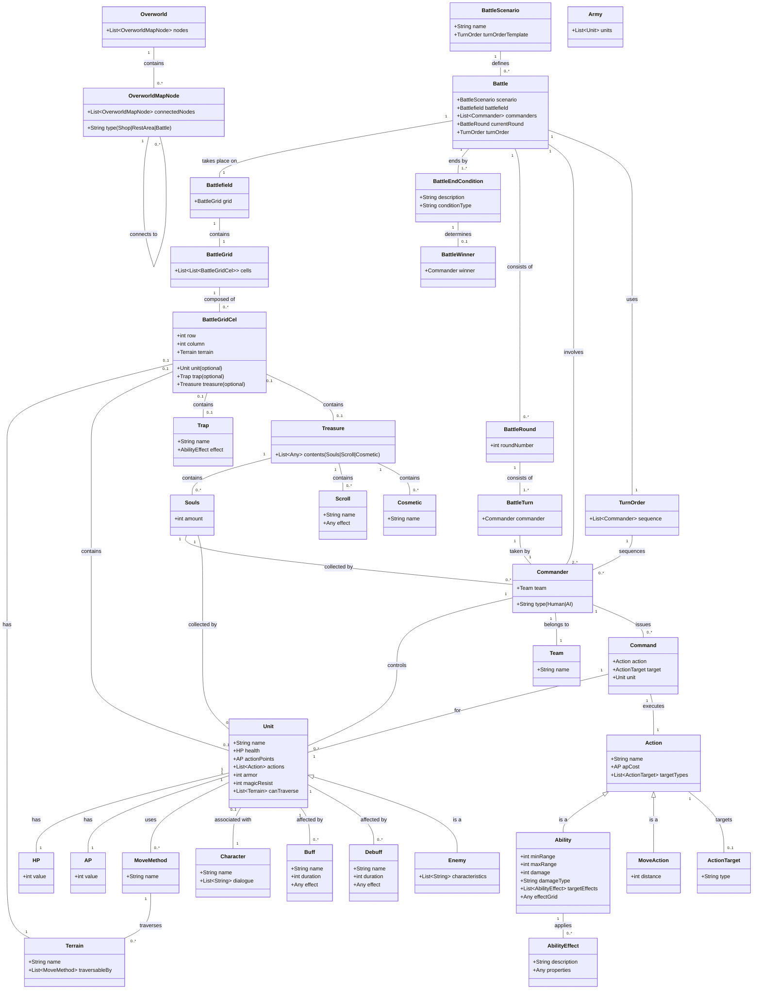

  
# Pillars
  
  
  
# Summary
  
You control a party of adventurers deep in a dungeon. You make your way up and out of the dungeon level by level (floor by floor).
On each floor of the dungeon, there is a map to see the level of the dungeon.
While on a particular floor of the dungeon, you can have encounters around the DungeonFloor.
  
  
  
# Encounters, not just Battles
  
Noting that we talked about moving around a grid outside of combat. it included discussing:
Encounter instead of assuming things are "Battle"
  
  
An Encounter can be something like a conversation.
  
# A larger Location than just a Battlefield
  
Instead of just a `Battlefield` , there is a larger continuous space of a `Location`. (DungeonLevel)
  
The grid then is... `LocationGrid` It extends accross the whole location
## Example of encounters placed around a Location.
Placed Encounters will need to match up with the `LocationGrid` of the `Location` (DungeonLevel)
An encounter can be a `Battle` that still has its own `Battlefield` that is used within the `Location` (DungeonLevel)
  
![[image.png]]
  
  
  
[[Design Notes]]
#### Definitions
| Name                                                                                             | Definition                                                                                                                                                                                                                                                                                                                                                                                                                                                                                      | Examples                                                                                                                           | Notes                                                                                                                                               | Properties                                                                                                                                                                                             | Tags |
| ------------------------------------------------------------------------------------------------ | ----------------------------------------------------------------------------------------------------------------------------------------------------------------------------------------------------------------------------------------------------------------------------------------------------------------------------------------------------------------------------------------------------------------------------------------------------------------------------------------------- | ---------------------------------------------------------------------------------------------------------------------------------- | --------------------------------------------------------------------------------------------------------------------------------------------------- | ------------------------------------------------------------------------------------------------------------------------------------------------------------------------------------------------------ | ---- |
| [[Battle]]                                                                                       | The specific battle that takes place      Essentially a type of level.   Takes place on a   [[Battlefield]] .   Multiple can occur on the same   [[Battlefield]] .   Requires at least 2   [[Commander]] to be started   During this, each   [[Commander]] takes their turn until there is an `end_battle` condition.   If an   `end_battle` condition occurs, the winner is decided by the condition.                                                      |                                                                                                                                    |                                                                                                                                                     | battlegrid (logic) (source of truth for what’s in each tile unit, trap, ground, effects.)   battlefield (decorations   grid_object_layout   unit   trap   dict[Vector2i, BattleGridCel] |      |
| [[Team]]                                                                                         | A generic association for a [[Commander]]   Used during a   [BattleScenario](https://www.notion.so/BattleScenario-22b16088def0804090d4dc0060165230?pvs=21) for designing generically before there are any concrete [[Commander]]         [[Commander]] is considered on a team.   A   [[Unit]] in play must be on a team.      The team of a   [[Unit]] could possibly change under some circumstance.      The team of a   [[Commander]] cannot change. |                                                                                                                                    |                                                                                                                                                     |                                                                                                                                                                                                        |      |
| [[TurnOrder]]                                                                                    | Can be set by the [BattleScenario](https://www.notion.so/BattleScenario-22b16088def0804090d4dc0060165230?pvs=21)   Determines in what order each   [[Commander]] will take their [[BattleTurn]]                                                                                                                                                                                                                                                                                           |                                                                                                                                    |                                                                                                                                                     |                                                                                                                                                                                                        |      |
| [[BattleEditor]]                                                                                 |                                                                                                                                                                                                                                                                                                                                                                                                                                                                                                 |                                                                                                                                    | You can assign and edit a battlefield (setting for a battle)   Then you can add layers for unit, hazard, based on the battlefield as a reference |                                                                                                                                                                                                        |      |
| [[BattleEndCondition]]                                                                           | Any condition under which a given [[Battle]] would end.      Each   [[Battle]] must have at least 1 BattleEndCondition.                                                                                                                                                                                                                                                                                                                                                                | * Only 1 [[Commander]] has any remaining units.   * All of the treasure is destroyed.   * A commander chooses to flee / exit |                                                                                                                                                     |                                                                                                                                                                                                        |      |
| [[Location]]                                                                                     | Can be combat or non-combat encounters.   A level that is a combat encounter is a battle.                                                                                                                                                                                                                                                                                                                                                                                                    | Battle   Shop   Puzzle   MiniGame                                                                                         |                                                                                                                                                     |                                                                                                                                                                                                        |      |
| [[Battlefield]]                                                                                  | The environment upon which battles occur.   Can be reused for multiple battles.   Includes the tiles, walls, props, etc.                                                                                                                                                                                                                                                                                                                                                                  |                                                                                                                                    |                                                                                                                                                     |                                                                                                                                                                                                        |      |
| [[BattleRound]]                                                                                  | Occurs during a [[Battle]]   Each   [[Commander]] that still has any [[Unit]] in a [[Battle]] will be given a [[BattleTurn]] one time during a BattleRound                                                                                                                                                                                                                                                                                                                                |                                                                                                                                    |                                                                                                                                                     |                                                                                                                                                                                                        |      |
| [[BattleTurn]]                                                                                   | Occurs Once for each [[Commander]] with any remaining [[Unit]] during a [[BattleRound]]      It is the   [[Commander]] ‘s “turn”                                                                                                                                                                                                                                                                                                                                                       |                                                                                                                                    |                                                                                                                                                     |                                                                                                                                                                                                        |      |
| [[BattleWinner]]                                                                                 | When a [[BattleEndCondition]] is met, there is typically a winner. this is the winner based on the [[BattleEndCondition]]                                                                                                                                                                                                                                                                                                                                                                       |                                                                                                                                    |                                                                                                                                                     |                                                                                                                                                                                                        |      |
| [[Unit]]                                                                                         | Any Entity on a [[BattleGrid]] that can be controlled by a [[Commander]]                                                                                                                                                                                                                                                                                                                                                                                                                        | Warlock, Skeleton, Viscera, Paladin                                                                                                |                                                                                                                                                     | value: tactical value / cost to have in army                                                                                                                                                           |      |
| [[Unit.value]]                                                                                   | The cost of a unit to include in an [[Army]]   Used to moderate overall army difficulty                                                                                                                                                                                                                                                                                                                                                                                                      | A brittle, melee unit is low cost.   A tough ranged unit is a higher cost.                                                      |                                                                                                                                                     |                                                                                                                                                                                                        |      |
| [[Army]]                                                                                         | All of the [[Unit]] under the command of a [[Command]]                                                                                                                                                                                                                                                                                                                                                                                                                                          |                                                                                                                                    |                                                                                                                                                     |                                                                                                                                                                                                        |      |
| [[Commander]]                                                                                    | Controls [[Unit]] on a [[Battlefield]] .   Alternates turns with any other commanders.   Controls when to end their turn.   Either an AI or Human   Can give a command to a   [[Unit]] under their control.                                                                                                                                                                                                                                                                      |                                                                                                                                    |                                                                                                                                                     | selected_object: Selectable                                                                                                                                                                            |      |
| [[Commander Board something]]                                                                    | The state of the commander’s control over the board.   Tracks what unit is selected…                                                                                                                                                                                                                                                                                                                                                                                                         |                                                                                                                                    |                                                                                                                                                     | selected_object: Selectable                                                                                                                                                                            |      |
| [[BattleGrid]]                                                                                   | The grid (array of arrays) of cells on the map.                                                                                                                                                                                                                                                                                                                                                                                                                                                 |                                                                                                                                    |                                                                                                                                                     |                                                                                                                                                                                                        |      |
| [[BattleGridCell]]                                                                                | An individual cel of the grid, where a specific BattleGridRow and BattleGridColumn overlap                                                                                                                                                                                                                                                                                                                                                                                                      |                                                                                                                                    |                                                                                                                                                     | unit: Unit   hazard: Hazard   effects: Array[GridCellEffect]                                                                                                                                     |      |
| [[Control]]                                                                                      | A commander has control over units on their team.   Control of one unit _could_ be passed from one [[Commander]] to another through something like a mind control spell or unit swapping ability.                                                                                                                                                                                                                                                                                            | Human commander controls their unit. They use mind control on an enemy unit.   They now also have control of the enemy unit.    |                                                                                                                                                     |                                                                                                                                                                                                        |      |
| [[Command]]                                                                                      | A [[Commander]] can issue this to a [[Unit]] that is under their command.   The command is to execute an   [[UnitAction]] with specific parameters.   If the unit cannot follow the command, the command is invalid and the command uses no AP   A command will usually use AP for the unit to complete the command.                                                                                                                                                                | Move to x, y   Attack target   Use ability on target   Use ability (no target)                                            |                                                                                                                                                     | Commander   Action                                                                                                                                                                                  |      |
| [[ActionExecutionCommand]] | An instance of a Commander telling a specific unit to execute a command.                                                                                                                                                                                                                                                                                                                                                                                                                        |                                                                                                                                    |                                                                                                                                                     | Commander   Action   Unit   Target(s)                                                                                                                                                         |      |
| [[GridCellCursor]]                                                                               | The object that is positioned over the tile while you hover over it. It doesn’t matter if the tile is valid or not, your cursor follows you and appears on top of any gridCel in play.   If you move off of the grid, your GridCellCursor remains on the last valid GridCell                                                                                                                                                                                                                 |                                                                                                                                    |                                                                                                                                                     | Commander   location: GridCel   state: selected, disabled, …                                                                                                                                     |      |
| [[UnitAction]]                                                                                   | Anything that a unit can do.   Typically has an AP cost.                                                                                                                                                                                                                                                                                                                                                                                                                                     | Move   Attack   Use a specific ability                                                                                       | How do we account for how Movement works???   Every time the cursor changes hovered, the actionPreview changes.                                  | ap_cost   target_constraints   is_target_valid(target)                                                                                                                                           |      |
| [[ActionPreview]]                                                                                |                                                                                                                                                                                                                                                                                                                                                                                                                                                                                                 |                                                                                                                                    |                                                                                                                                                     |                                                                                                                                                                                                        |      |
| [[ActionSelf]]                                                                                   | An action that is executed on self…      Somehow account for actions on self.                                                                                                                                                                                                                                                                                                                                                                                                             |                                                                                                                                    |                                                                                                                                                     |                                                                                                                                                                                                        |      |
| [[ActionGroup]]                                                                                  | A way to organize actions so that not all actions must be in a single list.      May be used for a category, but generally it’s just a group of actions for the purposes of organization, particularly so they show up in the UI in a way other than a single list per character                                                                                                                                                                                                          | Spell   Use Item                                                                                                                |                                                                                                                                                     |                                                                                                                                                                                                        |      |
| [[ActionTarget]]                                                                                 | [[UnitAction]] can sometimes have a target. This target is an ActionTarget in the context of the action being executed.      The target must be valid for the given action.   You cannot execute an action against a target that is not valid.                                                                                                                                                                                                                                         | [[BattleGridCell]]      [[Unit]] (enemy, ally)   Self (implied)?                                                           |                                                                                                                                                     |                                                                                                                                                                                                        |      |
| [[ActionTargetConstraint]]                                                                       | A constraint on whether a target is valid.                                                                                                                                                                                                                                                                                                                                                                                                                                                      |                                                                                                                                    |                                                                                                                                                     |                                                                                                                                                                                                        |      |
| [[TargetUnitConstraint]]                                                                         | A constraint on whether a specific Unit is a valid target                                                                                                                                                                                                                                                                                                                                                                                                                                       |                                                                                                                                    |                                                                                                                                                     |                                                                                                                                                                                                        |      |
| [[TargetGridCelConstraint]]                                                                      | A constraint on whether a specific GridCel is a valid target for a given action                                                                                                                                                                                                                                                                                                                                                                                                                 |                                                                                                                                    |                                                                                                                                                     |                                                                                                                                                                                                        |      |
| [[Untitled 2]]                                                                                   |                                                                                                                                                                                                                                                                                                                                                                                                                                                                                                 |                                                                                                                                    |                                                                                                                                                     |                                                                                                                                                                                                        |      |
| [[AP (ActionPoints)]]                                                                            | Spent in order to complete an action.   A   [[Unit]] must have enough AP to take the action.                                                                                                                                                                                                                                                                                                                                                                                              |                                                                                                                                    |                                                                                                                                                     |                                                                                                                                                                                                        |      |
| [[HP (HealthPoints)]]                                                                            | When a unit reaches 0 HP, they die. (typically)                                                                                                                                                                                                                                                                                                                                                                                                                                                 |                                                                                                                                    |                                                                                                                                                     |                                                                                                                                                                                                        |      |
| [[Character]]                                                                                    | Anything that will speak or have dialogue must have this entity   A   [[Unit]] may be associated with 1 character      A Character is part of the story.   A Character can have dialogue.                                                                                                                                                                                                                                                                                        | The Paladin Character is used for dialogue.   The Paladin   [[Unit]] is used in combat                                       |                                                                                                                                                     |                                                                                                                                                                                                        |      |
| [[Ability]]                                                                                      | A Type of [[UnitAction]] that typically has some kind of special effects.      Different   [[Unit]] _could_ have the same ability.      A   [[Commander]] can give a [[Command]] to a [[Unit]] to take an [[UnitAction]] that uses an [[Ability]] on a valid [[ActionTarget]]                                                                                                                                                                                                 |                                                                                                                                    |                                                                                                                                                     |                                                                                                                                                                                                        |      |
| [[Move]]                                                                                         | Can be used as part of another [[UnitAction]] and combined with swapping, attacking as part of other [[UnitAction]]      Anything that can move determines whether or not it   `can_traverse` any particular terrain.      Some   `can_traverse` ground obstacles.      fewer (or none)   `can_traverse` walls.                                                                                                                                                      |                                                                                                                                    |                                                                                                                                                     |                                                                                                                                                                                                        |      |
| [[MoveAction]]                                                                                   | A type of [[UnitAction]] that consists of only moving.      A type of   [[UnitAction]] . Most [[Unit]] can take this [[UnitAction]] .                                                                                                                                                                                                                                                                                                                                                  |                                                                                                                                    |                                                                                                                                                     |                                                                                                                                                                                                        |      |
| [[MoveMethod]]                                                                                   | The method by which a [[Unit]] can [[Move]]      Along with   [[Terrain]], these determine how a [[Unit]] can potentially [[Move]] from one [[BattleGridCell]] to another.      A   [[Unit]] that can [[Move]] must use this to move.      A   [[Unit]] that cannot [[Move]] does not need this.      A   [[Unit]] could have more than one and can use the valid one automatically.                                                                         | Fly   Walk   Teleport   Phase   Jump                                                                                   |                                                                                                                                                     |                                                                                                                                                                                                        |      |
| [[Traverse]]                                                                                     | A [[Unit]] must do this to the [[Terrain]] that is on a [[BattleGridCell]]      A unit may not be able to traverse a terrain.   A unit navigation path will not try to navigate over a cel if the unit cannot traverse the terrain on the cel.                                                                                                                                                                                                                                          |                                                                                                                                    |                                                                                                                                                     |                                                                                                                                                                                                        |      |
| [[Terrain]]                                                                                      | What is on a [[BattleGridCell]] that can influence the ability for a [[Unit]] to [[Move]] on it based on its movemethod                                                                                                                                                                                                                                                                                                                                                                          |                                                                                                                                    |                                                                                                                                                     |                                                                                                                                                                                                        |      |
| [[Turn Based Dungeon Crawler Jam Page/Game Design Doc/Definitions/Overworld\|Overworld]]         | Made up of a graph of nodes.      Each node s                                                                                                                                                                                                                                                                                                                                                                                                                                             |                                                                                                                                    |                                                                                                                                                     |                                                                                                                                                                                                        |      |
| [[OverworldMapNode]]                                                                             | Can be one of a few types:   * Shop   * Rest Area   * Battle                                                                                                                                                                                                                                                                                                                                                                                                                           | Shop, Rest Area, Battle                                                                                                            |                                                                                                                                                     |                                                                                                                                                                                                        |      |
| [[Cutscene]]                                                                                     | A non-interactive sequence in the game.                                                                                                                                                                                                                                                                                                                                                                                                                                                         |                                                                                                                                    |                                                                                                                                                     |                                                                                                                                                                                                        |      |
| [[Dialogue]]                                                                                     |                                                                                                                                                                                                                                                                                                                                                                                                                                                                                                 |                                                                                                                                    |                                                                                                                                                     |                                                                                                                                                                                                        |      |
| [[DialogueTimeline]]                                                                             | Spoken or written conversation between characters.                                                                                                                                                                                                                                                                                                                                                                                                                                              |                                                                                                                                    |                                                                                                                                                     |                                                                                                                                                                                                        |      |
| [[Map]]                                                                                          |                                                                                                                                                                                                                                                                                                                                                                                                                                                                                                 |                                                                                                                                    |                                                                                                                                                     |                                                                                                                                                                                                        |      |
| [[Trinket]]                                                                                      | A piece of Equipment that can be equipped on a Unit                                                                                                                                                                                                                                                                                                                                                                                                                                             |                                                                                                                                    |                                                                                                                                                     |                                                                                                                                                                                                        |      |
| [[Equip]]                                                                                        |                                                                                                                                                                                                                                                                                                                                                                                                                                                                                                 |                                                                                                                                    |                                                                                                                                                     |                                                                                                                                                                                                        |      |
| [[Scroll]]                                                                                       | An item that can be collected.   Maybe purchased or looted from a treasure chest                                                                                                                                                                                                                                                                                                                                                                                                             |                                                                                                                                    |                                                                                                                                                     |                                                                                                                                                                                                        |      |
| [[Counter Attack]]                                                                               | When a unit is hit by an enemy attack, some units have a chance to counter attack                                                                                                                                                                                                                                                                                                                                                                                                               |                                                                                                                                    |                                                                                                                                                     |                                                                                                                                                                                                        |      |
| [[Treasure]]                                                                                     | Collectible items found in battles.                                                                                                                                                                                                                                                                                                                                                                                                                                                             |                                                                                                                                    |                                                                                                                                                     |                                                                                                                                                                                                        |      |
| [[UnitRemains]]                                                                                  | What is left after a unit is defeated.                                                                                                                                                                                                                                                                                                                                                                                                                                                          | Blood spot                                                                                                                         |                                                                                                                                                     |                                                                                                                                                                                                        |      |
| [[Souls]]                                                                                        | Currency used                                                                                                                                                                                                                                                                                                                                                                                                                                                                                   |                                                                                                                                    |                                                                                                                                                     |                                                                                                                                                                                                        |      |
| [[EncoutnerBonus]]                                                                               | An additional reward, or a penalty if a character dies.                                                                                                                                                                                                                                                                                                                                                                                                                                         | ◦ Less turns you take, more bonus   ◦ Penalty if a character dies.   ◦ Class-based like How long you keep rage               |                                                                                                                                                     |                                                                                                                                                                                                        |      |
| [[adjacent]]                                                                                     | When a unit is on a gridCel directly adjacent to another unit                                                                                                                                                                                                                                                                                                                                                                                                                                   |                                                                                                                                    |                                                                                                                                                     |                                                                                                                                                                                                        |      |
| [[Enemy]]                                                                                        | A Unit                                                                                                                                                                                                                                                                                                                                                                                                                                                                                          |                                                                                                                                    |                                                                                                                                                     |                                                                                                                                                                                                        |      |
| [[Swap]]                                                                                         | An action where a unit changes positions with another.                                                                                                                                                                                                                                                                                                                                                                                                                                          |                                                                                                                                    |                                                                                                                                                     |                                                                                                                                                                                                        |      |
| [[Proximity]]                                                                                    |                                                                                                                                                                                                                                                                                                                                                                                                                                                                                                 |                                                                                                                                    |                                                                                                                                                     |                                                                                                                                                                                                        |      |
| [[Projectile]]                                                                                   | An object launched in combat.   Can have an arc that goes over obstacles   Can move horizontally and hit obstacles.                                                                                                                                                                                                                                                                                                                                                                       | Arcing artillery shell   Arrow   Fire bolt                                                                                   |                                                                                                                                                     |                                                                                                                                                                                                        |      |
| [[Trap]]                                                                                         | A device on the map designed to cause harm or hinder units.                                                                                                                                                                                                                                                                                                                                                                                                                                     | Exploding barrel                                                                                                                   |                                                                                                                                                     |                                                                                                                                                                                                        |      |
| [[Hazard]]                                                                                       | A dangerous element on the map.                                                                                                                                                                                                                                                                                                                                                                                                                                                                 |                                                                                                                                    |                                                                                                                                                     |                                                                                                                                                                                                        |      |
| [[Obstacle]]                                                                                     | An impassable or hindering object on the Battlefield.                                                                                                                                                                                                                                                                                                                                                                                                                                           |                                                                                                                                    |                                                                                                                                                     |                                                                                                                                                                                                        |      |
| [[Debuff]]                                                                                       | A negative effect on a unit.                                                                                                                                                                                                                                                                                                                                                                                                                                                                    |                                                                                                                                    |                                                                                                                                                     |                                                                                                                                                                                                        |      |
| [[Buff]]                                                                                         | A positive effect on a unit.                                                                                                                                                                                                                                                                                                                                                                                                                                                                    | Increase atk, increase def                                                                                                         |                                                                                                                                                     |                                                                                                                                                                                                        |      |
| [[Turn Based Dungeon Crawler Jam Page/Game Design Doc/Definitions/Untitled\|Untitled]]           |                                                                                                                                                                                                                                                                                                                                                                                                                                                                                                 |                                                                                                                                    |                                                                                                                                                     |                                                                                                                                                                                                        |      |
| [[Untitled 3]]                                                                                   |                                                                                                                                                                                                                                                                                                                                                                                                                                                                                                 |                                                                                                                                    |                                                                                                                                                     |                                                                                                                                                                                                        |      |
  
  
@Simpathey Do you think you could assist with designing the unit health / action economy? At the moment, just having some broad strokes direction would help
  
# The Battle Experience
# Unit Economy
  
#### Units
|Name|Type|Characterics|Range|Movement|AP|HP|MoveMethod|Damage|Description|Behavior|Abilities|Money|
|---|---|---|---|---|---|---|---|---|---|---|---|---|
|[[Skeleton]]|Minion|low damage, low health, melee|1|1|2|2|Walk|2|Basic, weakest enemy||[[Melee Attack]]|2|
|[[Skeleton Archer]]|Ranged 8 directions|low damage, low health, ranged|1-10|1|2|1|Walk|2|Basic, fragile, direct line ranged enemy||[[Ranged Attack]]|5|
|[[Viscera]]|Artillery|ranged|2-5|0|2|2|None|2|Cannot attack adjacent cells.   AOE damage on attacked cell.   Can attack within x distance. (5)?||[[Shoot Arrow]], [[Shoot Barrel Trap]]|4|
|[[Flying (something)]]|Melee|fast, low damage, low health|1|2|3|2|Fly|1|Fast, low damage, swam, fly over obstacles, coordinates to swam, bonus to atk when swamed|||7|
|[[Heavy Unit]]|Melee|Slow, high damage|1-2|1|2|5|Walk|4|Heavy slow unit that can slam for a melee attack.|They can only move every other turn?||10|
|[[Healing Unit]]|Melee, Spell|fast, low health|1|2|3|1|Walk|1|||[[Heal Alli 2 hp]]|10|
|[[Large Flying Monster]]|Melee, Ranged 8 directions|Slow, medium damage|1-5|1|3|5|Fly|3 melee or 1 ranged|A slow heavy flying creature who is dangerous from a far but even more so up close. Keep your distance|||15|
|[[Rogue]]|||||||Walk||||[[Swap with Enemy]], [[Rogue Attack]]||
|[[Paladin]]|||||||Walk||||||
|[[Warlock]]|||||||Walk||||[[Force Bolt]]||
|[[Wraith]]|||||||||||||
  
  
  
#### Abilities
|Name|Name in Menu|Description|Units|
|---|---|---|---|
|[[Force Bolt]]|Force Bolt|Damages enemy and pushes them back 1 tile|[[Warlock]]|
|[[Teleport]]|Teleport|||
|[[Shoot Arrow]]|||[[Viscera]]|
|[[Attack]]||||
|[[Swap with Enemy]]|Shadow Swap||[[Rogue]]|
|[[Rogue Attack]]|Attack||[[Rogue]]|
|[[Melee Attack]]|Attack|Single target, range 1, basic melee /physical for both enemy and player units|[[Skeleton]]|
|[[Ranged Attack]]|Volley||[[Skeleton Archer]]|
|[[Slash Attack]]||||
|[[Heal Alli 2 hp]]||Heals the lowest alli for 2 hp|[[Healing Unit]]|
|[[Shoot Barrel Trap]]||Lobs a barrel trap up to 5 tiles away in the direction of the closest enemy|[[Viscera]]|
  
  
#### Items
|Name|Description|
|---|---|
|[[Attack up scroll]]|Increase attack by 1|
|[[Defense up scroll]]|Increase Defense by 1|
  
  
  
#### Attributes
|Name|Description|
|---|---|
|[[Attack Power]]||
|[[Defense]]||
|[[Action Points]]||
|[[Health Points]]||
|[[Movement Speed]]||
|[[Turn Based Dungeon Crawler Jam Page/Game Design Doc/Attributes/Untitled\|Untitled]]||
|[[Turn Based Dungeon Crawler Jam Page/Game Design Doc/Attributes/Untitled 2\|Untitled 2]]||
  
  
# Narrative Outline
  
## Start game
  
- Text, narration. An introduction to the story
- You are on the overworld map.
  
  
  
  
- Combat is on a grid.
- Positioning is key.
- There are different character classes.
- Each class utilizes positioning differently.
- Example class / positioning mechanics:
    - A Rogue does more damage, the fewer adjacent enemies, the more damage
    - A wizard can cast spells like AOE, cones, etc.
    - A barbarian does more damage the more enemies they are around
- There are traps on the map.
- some characters can SWAP position with other characters.
- This ability may be limited in use.
  
## How do you win?
- You work your way through the dungeon and exit.
  
## What does progression look like?
- You unlock abilities over time.
- Abilities can be locked behind “milestones” / gates / currency
- Currency is “souls”
  
  
  
## Traps
- Exploding barrel is
  
## Swap
Rogue
- Swap with any enemy
Paladin swap:
- With any ally (protect)
- Any adjacent enemy
Warlock:
- Swap places with any trap / interactable
- Make 2 enemies swap places
  
## Overworld
  
- You don’t know what each node is until you land on it.
- Node types:
    - A battle
    - A minigame
    - A “rest” point of some kind.
  
![[image 1.png]]
## Currency
- There is no gold
- You earn “souls”
- You can spend souls to unlock new areas on the overworld
  
## Equipment
- No purchasing, no equipping or unequipping.
- Any equipment is static
  
## Upgrade
- You have some way to improve
- You can unlock abilities with souls
  
## Party
- You start with a party of x members.
  
# AP
- Resets each turn
- Each action takes some AP
- Stronger attacks use more AP
- Enemies and characters have Action Points
- Moving uses AP
    - Movement cost depends on the character
  
## Classes:
  
## Abilities
- Warlock:
    - Ranged single target spell/attack
    - Does more damage the further they are from enemies
    - (They have the push your luck magic ability) [[Push your luck Magic]]
    - Spell 1 (push your luck)?
    - Spell 2 (push your luck)?
    - Spell 3 (push your luck)?
    - They can switch places with anything (or any enemy) that has been cursed. Or they can swap any 2 cursed things with each other.
- Paladin
    - Attack
    - Defense goes higher the more enemies around them
    - Class-based ability: debuffs, taunts target
        - Debuff AP
        - Debuff Damage
        - Debuff Movement
    - Swap: Choose an ally, when they are about to be hurt, you swap with them.
- Rogue
    - Ranged attack (bow)
    - If no ally and only 1 enemy within x squares, do x more damage when u attack.
    - Special ability (passive)
        - Refresh your AP and movement on kill
    - Mobility (swap)
        - Swap with an enemy
    
  
Potential to add items for each character (nice to have)
- Traps for rogues
- Things that taunt/move enemies
- Minion for warlock
  
# Ability parameters
- Minimum range
- Maximum range
- Targetable types (tile, ally, opponent, object)
- Damage
- Damage type
- Target Effects: (AbilityEffect) the effect the ability has on the target
- Effect grid: a grid with the effects on it.
![[image 2.png]]
![[image 3.png]]
![[image 4.png]]
  
# Tool: Ability Editor
Allows you to preview and edit an ability
Edit all parts including visual parts
Uses a tilemaplayer to allow you to preview the damage / effect area
Stores grid-based effects in tilmap
Tiles of the tilesets store custom data including their damage, effects, etc.
  
# Scaling
- Support scaling individual ability damage
- Support scaling all character damage
- Support the control of AP/square moved
  
# Combat stats
  
- Individual ability damage
- Individual ability damage scale
- Character defense (damage reduction)
- Individual ability AP cost
- Movement speed
- Character Health
    - Does not restore between rounds
- Character AP
  
  
![[image 5.png]]
  
# Combat sequence of events
  
During a ROUND
Each Commander gets a turn in the TURN_ORDER
When a commander’s TURN starts, the COMMANDER gains CONTROL
CONTROL, COMMAND
  
UNIT CONTROL
Control units with commands
  
Select a unit
Select an action / issue a command to the unit.
  
# Combat
  
- The player and the enemy each have a `turn`
- During the player’s `turn`, they can `select` and control each of their characters
- You `click` on a `unit` to `select` it.
    - You can `select` any `unit`.
    - When you have a `unit` you control `selected`, you can issue it `commands`
- If a unit is selected and is controlled by you:
    - Show the area around the unit to which they can move.
        
        - This is a green translucent overlay
        
        ![[image 6.png]]
        
    - if you hover over a tile:
        
        - Calculate the number of AP to move to the tile.
        - You see the AP that would be used under the cursor
        
        ![[image 7.png]]
        
        - you see a `navigation_path_preview` of where the player would move.
![[2025-07-07_20-54-16.gif]]
  
- If you **click** anywhere that is not `clickable` (eg. unit, etc.) then the last `clickable` unit is `deselected`.
![[image 8.png]]
- If you have a `unit` under your control `selected` and you click on a `tile` that is `traversable` to which you `can afford to move`, you move to that tile along the `navigation_path` shown in the `navigation_path_preview`
  
  
- You see in a UI panel:
    
    - AP
    - Health
    - Available actions (with their cost)
    
      
    
    ![[image 9.png]]
    
- If you have your character selected and hover the map, you can see the path they would walk to move to that location.
    
    - You can see how much AP that would spend.
    - You can see the max distance they would move.
    
      
    
    ![[image 10.png]]
    
- If you click an ability from the list of abilities, that ability becomes active.
    - For an attack ability, when you have it active then hover over an enemy, it highlights the enemy.
    
    - The cursor changes to show it would damage the enemy
    
![[image 11.png]]
- When you click on a valid target while the ability is active, that ability is used.
    - Some action occurs and an animation may play.
    - Any damage is dealt as part of the action ( will need to match the animation)
## Enemy takes damage
- When an enemy takes damage, they:
- flash white
- plays animation `hit_react`
    
    ![[fd0653ab80324ad2c9bc9c578d7e46ca_(1).gif]]
    
![[image 12.png]]
  
- If an enemy is killed:
    - The enemy plays animation `death`.
    - Plays death sound.
    - Once sound and animation done, :
        - Enemy body disappears
    - Leaves a blood spot (nice to have)
- There is a button labeled (End Turn) on the top left of screen.
    
    ![[Snag_71503f5.png]]
    
- When no actions or movement are available for any characters, the button glows
    
    ![[2025-07-07_21-15-07.gif]]
    
  
- When the player presses the `EndTurnButton`, their turn ends.
  
# Enemy Turn
  
## Planning phase
- The enemy cycles through possible outcomes that it can achieve with its available units.
- More advanced AI: The enemy calculates potential outcomes, checking possible actions and outcomes between all units by producing and evaluating each permutation.
    - AI scores are associated with various outcomes, including damage to the player, positioning, player debuffs, treasure destroyed.
    - The enemy team chooses the outcome with the best score.
- More basic AI:
    - Each enemy does the most valuable action it can take:
        - If able to attack player, attack
        - If melee and able to move closer to player, move to player
        - If ranged and able to move away, move away
  
# AI behavior
The enemy overall is a player itself and we should treat it as such.
Meaning the enemy has the ability to select units and use abilities of any unit just like the player.
The enemy AI should have decision-making behavior similar to that of a human.
It should be possible to swap in a real human player and give a real human player control over the opposing team and they should be able to do everything the AI would have done.
An AI should also be able to take all actions a human could take with the player character units.
  
# AI actions
- some_units_have_available_actions
- unit_has_available_actions(unit)
- get_nearest_enemy(unit)
  
  
### Enemy takes actions
- The AI opponent selects a controlled unit.
- AI unit is highlighted just like the player unit was.
- Default ai-controlled melee skeleton behavior:
    - Calculate the `nearest_enemy_unit` to the `selected_unit`
    - Enemy `Skeleton` walks up to the nearest player-controlled `unit`.
- `Skeleton` attacks the player `unit`.
![[fd0653ab80324ad2c9bc9c578d7e46ca_(1).gif]]
  
  
  
  
  
~~Barbarian~~
- ~~Rage meter~~
- ~~Taunt~~
- ~~Diff attacks~~
- ~~Some def abilities?~~
## Health pool
- You can increase your health pool by spending souls
  
## Ability Points
- You can increase ability points
  
## Damage types
- Physical
- Magical
- (maybe others)
  
  
## Enemy characteristics
- Melee only
- Ranged only, physical
- Ranged only, magical
  
## Enemies
- Skeleton
    - Weak
    - Physical
    - Melee only
- Skeleton bowman
    - Weak
    - physical
    - Ranged
- Flying Beaver
- Goblins
    - medium
    - Physical
- Goblin Shaman
    - Medium
    - Magical
    - Ranged only
    - Buffs nearby goblins with extra movement or attack power.
- Ghost / spirit
    - Only hurt by magic
- Ghoul
- Zombie
- Wisp
- **Bone Colossus**
    - **Strong**
    - **Physical**
    - **Melee only**
    - Huge area attack that hits all adjacent tiles. Slow movement.
- **Possessed Armor**
    - **Medium**
    - **Physical**
    - **Melee only**
    - Immune to knockback and slows enemies it hits
- **Shade Stalker**
    - **Medium**
    - **Magical**
    - **Melee only**
    - Invisible until it attacks. Can pass through walls or terrain.
  
  
## Treasure
- There are some treasure chests in battles
- They can contain:
    - Souls
    - Scrolls
    - Cosmetics (nice to have)
- Some enemies try to destroy treasure.
- Some items MAY only be able to be collected once (to prevent OP grinding)
  
## Core Stats
Armor, Magic resist, physical attack, magic attack, range, health
On Magic Item Slot ^ It would affect these stats just like +
  
  
## Shop
- You can spend souls at a shop on the overworld.
- You can select each party member to see their stats
- UI similar to old school RPG / provided examples
  
## Story
- Chunks of story threaded throughout the game, similar to the provided Dungeon crawler examples
- Basic goal, conflict, story progression.
- You have a party of characters (that have dies in the dungeon) The have been reanimated and they are trying to escape.
- You are going from the depths up to the surface.
  
  
## Setting
- You are in limbo.
  
## UI Style
- Similar to the provided examples, old school RPG
  
  
## Simpathy
- Player Economy
    - Specific upgrades
    - Specific Items
    - Spreadsheets
    - How long the game is
    - Pacing of progression
    - Shop economy
    - Shop UI
  
## Summary
- Team based tactics
- Movement, abilities,
  
[[Push your luck Magic]]
  
  

[[Equipment Ideas]]
[[UI Design]]
[[Player Economy (Souls)]]
[[Overworld]]