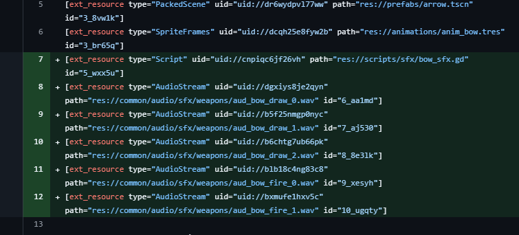
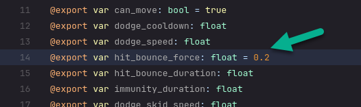
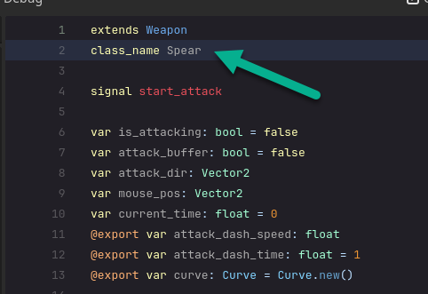

# Retro notes

## Use a specific node when adding a node to the scene tree

https://github.com/Screwloose-Games/pirate-jam-16/commit/3ee74d162c4eab03a03bb4fba504a75d90847b14#diff-aa24a46fa791938a3c158c73e6fb0ac32581228845c007c7b5f6b95b1a617c30R80

https://chatgpt.com/share/679a761a-85f0-8008-863a-d3311e1cf6dc

## Pipeline for vector art

## Pipeline for spritesheets with Adobe Animate


The following assumes all states are direct descendents of the state machine and require anything using the statemachine to run a custom "init" function to be called. It's not obvious.

```gdscript
# Initialize the state machine by giving each child state a reference to the
# parent object it belongs to
func init(parent: Character, animations: AnimatedSprite2D) -> void:
	for child in get_children():
		child.parent = parent
		child.animations = animations

	# Initialize to the default state
	change_state(starting_state)
```


## Reduce changes to primary game object prefabs

For the folowing example, perhaps make a subscene?



## Signal connections

- Use the .gd file to setup signal connections so that they are all in the same place (sometime signals can ONLY be in code) and so that we minimize changes to .tscn files.


## Reduce export values getting reset to null / 0

- Use default values for alll @export values when they are created.
- As better default values are discovered through experimentation, update the default values.




## Use @onready instead of @export where possible

- This reduces the number of things that can be changed in the editor and helps to ensure that the values are not null when used.
- References to animation players, state machines, etc.

## Use @export when values are expected to be calibrated

- Speed, damage, etc.

## Use @export when the value is used before the node is "ready"

- If something is set at @onready, but you find the value null when you try to reference it in something like _init or _ready, then you should use @export instead.

## Reporting errors to be resolved

When you identify a reproducable issue and you can't resolve it yourself, do the following:

- dulpicate the scene where you experienced the issue
- put it under a test directory
- remove unneccesary nodes from the scene.
- Reorganize the scene so the bug occurs as quickly as possible with little user input.
- Copy the path to the scene.
- Create a bug ticket.
- Explain the issue
- Include the path to the scene in the bug ticket.

## Use Class Names

- It allows you to check type at runtime. `if weapon is Spear`



## Use an animation tree and a blend 2d node to blend sprite animations

<https://www.youtube.com/watch?v=Xf2RduncoNU>

## Use Curves

- Accelerations
- Decelerations
- Taper off of damage over distances
- Taper off an effect over time / distances
- Making things "wiggle" or "bounce"
- Making things "shake"
- Making things "pulse"

## Use Nav agents for navigation

## Determine what dimentions are needed for sprites

[text](vector-game-art-sheet.md)

